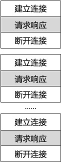
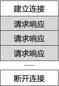

# HTTP

## HTTP 概述

HTTP（HyperText Transfer Protocol，超文本传输协议）是一种 Request - Response 协议，运行在 TCP 协议之上。由 CERN（欧洲核子研究组织）的 Tim BernersLee 博士提出。

## HTTP 协议的发展

### HTTP/0.9

HTTP/0.9 可以认为是 HTTP/1.0 以前的版本，于 1991 年问世。HTTP/0.9 只支持 GET 请求方式，不支持请求头。

### HTTP/1.0

HTTP/1.0 于 1996 年 5 月发布，记载于 [RFC1945](https://www.ietf.org/rfc/rfc1945.txt) 中。

### HTTP/1.1

HTTP/1.1 于 1997 年 1 月发布，发布最初的标准是[RFC2068](https://www.ietf.org/rfc/rfc2068.txt)，1999 年 6 月发布了[RFC2616](https://www.ietf.org/rfc/rfc2616.txt)标准，在 2014 年 6 月，HTTP 工作组发布了[RFC7230](https://www.ietf.org/rfc/rfc7230.txt)、[RFC7231](https://www.ietf.org/rfc/rfc7231.txt)、[RFC7232](https://www.ietf.org/rfc/rfc7232.txt)、[RFC7233](https://www.ietf.org/rfc/rfc7233.txt)、[RFC7234](https://www.ietf.org/rfc/rfc7234.txt)、[RFC7235](https://www.ietf.org/rfc/rfc7235.txt)几个标准，对于 HTTP/1.1 进行更新。

### HTTP/2.0

HTTP/2.0 于 2015 年 5 月发布，标准为[RFC7540](https://www.ietf.org/rfc/rfc7540.txt)。

## HTTP 协议通信

HTTP 协议与 TCP/IP 中众多协议相同，用于客户端和服务端通讯。其中，发出请求的一端为客户端，接收请求的为服务端。使用 HTTP 协议时，必然是一端为客户端，另一端为服务端。

HTTP 协议中规定，请求从客户端发出，由服务端响应请求并返回数据。


以下为客户端向服务端发送请求的内容

```
GET /book/tjhttp/c_01_http HTTP/2
Host: getaoning.com
```

其中，`GET`代表**方法**，`/book/tjhttp/c_01_http`代表`URI`，`HTTP/2`代表协议版本。第二行开始为请求头部（header）。

以下为服务端向客户端发送的响应内容：

```
HTTP/2 200 OK
server: nginx
date: Sat, 17 Jul 2021 13:04:12 GMT
content-type: text/html
content-encoding: gzip

<!DOCTYPE html>
<html lang="zh-CN">
...
```

其中，`HTTP/2`代表协议版本，`200`代表状态码，`OK`代表状态码的含义。

第 2 ～ 5 行为响应头部（header）。

最后一段则为响应主体。

## HTTP 不保存状态

HTTP 是一种无状态的协议。它不对请求与响应间的状态保存。这也使得 HTTP 协议如此高效。

然而，随着网络的发展，人们对于网络的需求越来越多。例如，用户登录一个网站，需要在跳转到该站其他页面时保存用户登录的状态。

针对这一需求，HTTP 引入了 Cookie 技术。

## HTTP 请求方法

| 方法    | 作用         |
| ------- | ------------ |
| GET     | 获取资源     |
| POST    | 传输数据     |
| PUT     | 传输文件     |
| HEAD    | 获取头部信息 |
| DELETE  | 删除文件     |
| OPTIONS | 查询方法     |
| TRACE   | 跟踪路径     |
| CONNECT | 使用网络隧道 |

## 持久连接

在最初的 HTTP 版本中，每进行一次 HTTP 请求都需要断开一次 TCP 连接。

这在当初通讯情况的条件下使用起来没有太大问题，但是随着 HTTP 逐渐普及，网页中包含大量请求的情况多了出来。



如图所示，在发送多个请求的同时，建立、断开了大量的连接，大大增加了服务器的开销。

于是，**持久连接**应运而生了。持久连接只要任意一段没有提出断开连接，则将保持 TCP 连接的状态。持久链接的好处在于减少了重复的 TCP 连接与断开连接过程，减轻了服务器的负载。同时也大大提高了网页的响应速度。



在 HTTP/1.1 中，所有连接默认都是持久连接。
